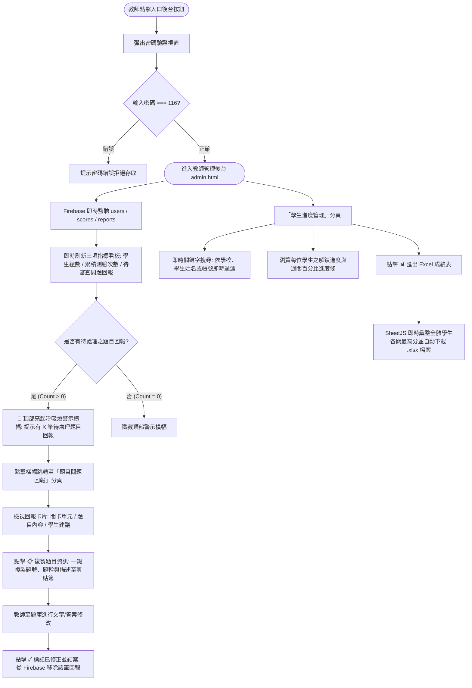

# 🎓《觀光餐旅業導論》雲端互動闖關與全真檢測系統
## 系統架構、資料流程與完整工作流指引 (Workflow & System Architecture)

---

## 📌 一、系統基本資訊與專案簡介

* **系統全名**：《觀光餐旅業導論》雲端互動闖關與全真檢測系統
* **主要用途**：專為全國高中職（觀光事業科、餐飲管理科、綜合高中觀光餐旅學程）升學衝刺量身打造的跨平台、免安裝雲端自主學習與測驗工具。
* **技術架構**：
  * **前端技術**：純原生 HTML5 / CSS3 (多主題切換、RWD 響應式佈局) / Vanilla JavaScript (ES6+)
  * **雲端後端 (Serverless)**：Google Firebase Realtime Database 即時資料庫 (同步學生帳號、測驗歷程、問題回報)
  * **第三方整合元件**：
    * `html2pdf.js`：學生端「📥 錯題解析 PDF 講義」動態生成與匯出
    * `SheetJS (xlsx.full.min.js)`：教師端「📊 32 關小考成績 Excel 總表」即時匯出
    * `Google Fonts` (Outfit + Noto Sans TC)
  * **代管部署**：GitHub Pages 靜態網站自動持續部署 (CI/CD)
* **線上正式網址**：
  * 🚀 **學生闖關首頁**：[https://abel54575457.github.io/tourism-quiz/index.html](https://abel54575457.github.io/tourism-quiz/index.html)
  * 💼 **教師管理後台**：[https://abel54575457.github.io/tourism-quiz/admin.html](https://abel54575457.github.io/tourism-quiz/admin.html) *(管理密碼：`116`)*

---

## 🧩 二、系統模組與檔案結構

```
tourism-quiz/
├── index.html          # [入口門戶] 學生登入/註冊、全國及校內即時英雄風雲榜、教師後台跳轉
├── game.html           # [闖關核心] 32 關卡地圖、小考答題介面、85分晉級判定、PDF講義匯出、問題回報
├── admin.html          # [教師後台] 學生進度監控、待辦問題回報中心 (呼吸燈警示)、Excel匯出
├── questions.js        # [題庫核心] 32 關卡、640 題次題庫 (含 440 題 100% 零重複核心題與精闢解析)
└── README.md           # 專案說明文件
```

---

## 🔄 三、核心工作流程 (Workflows)

### 3.1 學生端完整學習與測驗工作流 (Student Workflow)

```mermaid
flowchart TD
    Start([學生造訪系統入口 index.html]) --> InputAccount[輸入帳號與密碼]
    InputAccount --> CheckExist{帳號是否存在於 Firebase?}
    
    CheckExist -- 首次登入 --> RegModal[彈出註冊視窗: 選擇北中南東區域 -> 下拉選校 -> 填寫姓名]
    RegModal --> SaveUser[寫入 Firebase users 資料庫並建立 Session]
    
    CheckExist -- 已註冊帳號 --> VerifyPass{密碼是否相符?}
    VerifyPass -- 錯誤 --> AlertWrong[提示密碼錯誤]
    VerifyPass -- 正確 --> SaveUser
    
    SaveUser --> GamePage([進入關卡地圖 game.html])
    GamePage --> ViewMap[檢視 32 個關卡進度地圖: 依目前 unlocked_level 顯示已解鎖/鎖定]
    
    ViewMap --> ClickLevel[點選已解鎖關卡開始測驗]
    ClickLevel --> StartQuiz[載入該關 20 題隨機題序題庫]
    
    StartQuiz --> AnswerQ[閱讀題目與四選一選項 -> 點擊作答]
    AnswerQ --> ImmediateFeedback[即時動畫回饋: 綠色正確 / 紅色答錯並記錄錯題清單]
    ImmediateFeedback --> NextQ{是否已達第 20 題?}
    NextQ -- 否 --> AnswerQ
    
    NextQ -- 是 --> CalcScore[計算總分 (每題 5 分, 滿分 100 分)]
    CalcScore --> SaveScoreDB[非同步將成績寫入 Firebase scores 資料庫]
    
    SaveScoreDB --> ScoreCheck{得分 >= 85 分?}
    ScoreCheck -- 是 (及格通關) --> UnlockNext[解鎖下一關卡 (unlocked_level + 1) 並同步至 Firebase]
    ScoreCheck -- 否 (未達標) --> KeepLevel[保持目前關卡進度, 提示 85 分方可解鎖下一關]
    
    UnlockNext --> ResultView[結算畫面: 呈現分數、評語與錯題精闢解析]
    KeepLevel --> ResultView
    
    ResultView --> ChoiceA[🔄 再次挑戰本關]
    ResultView --> ChoiceB[⭐ 前往下一關 (依序進入章節總測驗或下一章)]
    ResultView --> ChoiceC[🗺️ 回關卡地圖]
    ResultView --> ChoiceD[📥 匯出錯題與解析 (下載 PDF 講義)]
    ChoiceD --> GenPDF[html2pdf 動態渲染專屬學習評量單並自動下載]
    
    ClickLevel -. 遇到爭議題目 .-> OpenReport[點擊 ⚠️ 問題回報]
    OpenReport --> SendReport[填寫描述並寫入 Firebase reports 資料庫]
```

#### 學生端步驟詳解：
1. **無感註冊與快速登入**：
   * 學生輸入自訂帳號與密碼。
   * 若為首次使用，系統自動彈出註冊視窗，提供「北區 / 中區 / 南區 / 東區及離島」分區下拉選校機制，學生只需選擇學校與填寫姓名即可完成註冊。
2. **階梯式闖關地圖**：
   * 系統即時連線雲端資料庫讀取 `unlocked_level`，解鎖對應關卡。
   * 學生必須獲得 **85 分以上（答對 17 題以上）** 才能順利通關並解鎖下一關。
   * 當學員完成某一章全部節次時，下一關會**無縫解鎖該章的「🏆 章節總測驗」**，通過後再自動開啟下一章節次！
3. **即時反饋與作答體驗**：
   * 每題點選後立即給予視覺回饋（正確顯示綠色呼吸框、錯誤顯示紅色震動框），並自動累計錯誤題目的題幹、學生作答、正確答案與考點解析。
4. **📥 下載錯題解析 PDF 講義**：
   * 測驗結束後，學生可一鍵點擊下載 PDF 講義。
   * 講義自動排版「學校、姓名、測驗單元、得分、錯題對照（含學生答案 ❌ 與標準答案 ✔️）、老師精闢考點解析」，支援離線複習與列印。
5. **即時排行榜榮譽激勵**：
   * 每筆作答完成後，首頁排行榜秒級自動更新，呈現全台總排行與校內排名。

---

### 3.2 教師端/管理者工作流 (Teacher/Admin Workflow)



---

## 📚 四、題庫架構與 32 關卡循序編排 (Question Bank Design)

題庫（`questions.js`）完全符合教育部 108 課綱與最新統測試題趨勢，共規劃 **32 個挑戰關卡、640 道挑戰題次**：

### 4.1 關卡完整循序清單

| 關卡編號 | 關卡名稱 / 評量單元 | 題數 | 關卡定位 |
| :---: | :--- | :---: | :--- |
| **第 1 關** | 第一章第1節：觀光與餐旅的定義與本質 | 20 題 | 第一章核心節次 |
| **第 2 關** | 第一章第2節：觀光餐旅業的行業統計與標準分類 | 20 題 | **最新主計總處代碼（O大類、S大類）** |
| **第 3 關** | 第一章第3節：觀光要素與觀光系統理論 | 20 題 | 第一章核心節次 |
| **第 4 關** | 第一章第4節：觀光發展的經濟、社會與環境衝擊 | 20 題 | 第一章核心節次 |
| **第 5 關** | 第一章第5節：國內外觀光組織與推動機構 | 20 題 | 第一章核心節次 |
| **第 6 關** | 🏆 **第 1 章總測驗：觀光餐旅導論與基本概念 統整測驗** | 20 題 | **第一章統整大考（過關開啟第二章）** |
| **第 7 關** | 第二章第1節：餐旅從業人員基本特質與專業素養 | 20 題 | 第二章核心節次 |
| **第 8 關** | 第二章第2節：餐旅職場職業道德與國際禮儀 | 20 題 | 第二章核心節次 |
| **第 9 關** | 🏆 **第 2 章總測驗：從業人員素養與職場倫理 統整測驗** | 20 題 | **第二章統整大考（過關開啟第三章）** |
| **第 10 關** | 第三章第1節：餐飲業的定義、特徵與發展史 | 20 題 | 第三章核心節次 |
| **第 11 關** | 第三章第2節：餐飲業類別與現代連鎖經營型態 | 20 題 | 第三章核心節次 |
| **第 12 關** | 第三章第3節：菜單設計原則與菜單工程獲利矩陣 | 20 題 | 第三章核心節次 |
| **第 13 關** | 第三章第4節：廚房組織架構與法語專業職掌 | 20 題 | 第三章核心節次 |
| **第 14 關** | 第三章第5節：法俄美英四大西餐服務方式與酒水 | 20 題 | 第三章核心節次 |
| **第 15 關** | 第三章第6節：餐飲成本控制、衛生安全與HACCP | 20 題 | 第三章核心節次 |
| **第 16 關** | 第三章第7節：宴會會議規劃與餐飲採購倉儲實務 | 20 題 | 第三章核心節次 |
| **第 17 關** | 🏆 **第 3 章總測驗：餐飲業概論與營運管理 統整測驗** | 20 題 | **第三章統整大考（過關開啟第四章）** |
| **第 18 關** | 第四章第1節：旅館業的定義、歷史與現代分類 | 20 題 | 第四章核心節次 |
| **第 19 關** | 第四章第2節：星級評鑑制度與民宿管理辦法 | 20 題 | 第四章核心節次 |
| **第 20 關** | 第四章第3節：客房類型與國際房價計價制度 | 20 題 | 第四章核心節次 |
| **第 21 關** | 第四章第4節：客務部組織職掌與夜間稽核作業 | 20 題 | 第四章核心節次 |
| **第 22 關** | 第四章第5節：房務部清潔流程、開夜床與備品管理 | 20 題 | 第四章核心節次 |
| **第 23 關** | 🏆 **第 4 章總測驗：旅館業概論與客務房務 統整測驗** | 20 題 | **第四章統整大考（過關開啟第五章）** |
| **第 24 關** | 第五章第1節：旅行業的定義、發展史與產業特性 | 20 題 | 第五章核心節次 |
| **第 25 關** | 第五章第2節：旅行業法規分類、業務權限與資本額 | 20 題 | 第五章核心節次 |
| **第 26 關** | 第五章第3節：國際航權理論、票務規則與GDS系統 | 20 題 | 第五章核心節次 |
| **第 27 關** | 🏆 **第 5 章總測驗：旅行業概論與遊程航權 統整測驗** | 20 題 | **第五章統整大考（過關開啟全真模考）** |
| **第 28~32 關** | 🎯 **全真模擬考 第 1 回 ～ 第 5 回 (共 5 回)** | 各 20 題 | **跨全冊 1~5 章統測級高擬真綜合模考** |

---

## 🚀 五、維護與部署作業流程 (CI/CD Maintenance)

### 5.1 題庫修改與重新編譯
```powershell
python build_perfect_database.py
```

### 5.2 推送發布至 GitHub Pages
```powershell
$git = "C:\Users\user\AppData\Local\GitHubDesktop\app-3.6.4\resources\app\git\cmd\git.exe"
& $git add index.html game.html admin.html questions.js WORKFLOW.md "觀光餐旅業導論_系統架構與完整工作流程.md"
& $git commit -m "Fix locked chapter summary exams by properly sequencing 32 levels"
& $git push origin main
```
* 推送至 `main` 分支後，GitHub Pages 將於 20~30 秒內自動完成全域線上更新！
